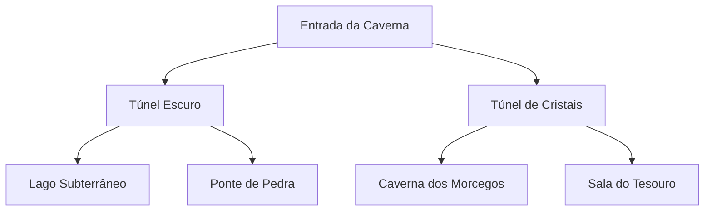

# Caverna em Árvore Binária

Projeto Java de terminal que representa a exploração de uma caverna como uma árvore de decisão. Cada sala é um nó: a pessoa usuária escolhe seguir pela passagem à esquerda ou à direita e pode retornar à sala anterior.

> Apesar do nome do repositório, a implementação atual usa uma árvore binária de navegação montada manualmente; ela não implementa operações de balanceamento AVL.

## Funcionalidades

- Exploração de salas conectadas como uma árvore binária.
- Escolhas de caminho à esquerda e à direita.
- Retorno à sala anterior.
- Menu interativo no terminal.

## Mapa da caverna



## Estrutura

```text
src/
├── Main.java  # Monta o mapa e inicia a aplicação
├── Menu.java  # Interação com a pessoa usuária
└── No.java    # Representa uma sala e suas conexões
```

## Como executar

É necessário ter um JDK instalado.

```bash
javac -d out src/*.java
java -cp out Main
```

## Ideias de evolução

- Criar eventos, itens e inimigos para cada sala.
- Gerar o mapa dinamicamente.
- Implementar uma AVL real, com inserções, rotações e balanceamento, caso esse seja o objetivo do repositório.
